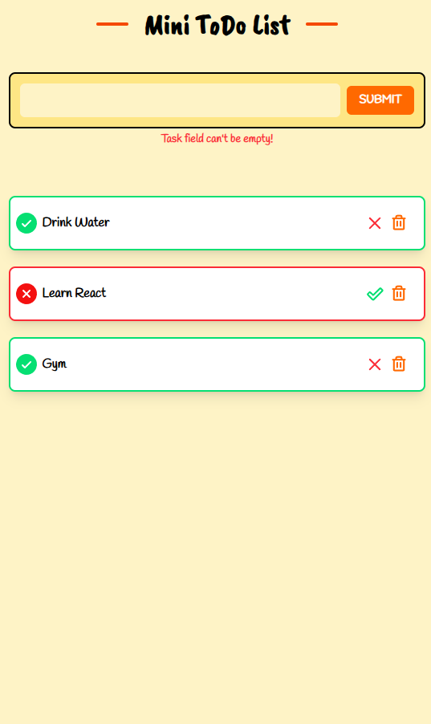

# 📝 Mini React ToDo List


A simple **React + Vite ToDo List** with modern features using **Context, Hooks, and Tailwind CSS**.  
Includes **add, delete, mark as done/undone tasks**, **animations**, and **empty input error handling**.

---

## 🚀 Features

- Add tasks with animation  
- Delete tasks with animation  
- Mark tasks as **done** or **undone**  
- Error handling for empty input field  
- Dynamic task list rendering  
- Responsive design with **Tailwind CSS**  

---

## 📸 Screenshots

  

---

## 🌐 Live Demo

[Live Demo](https://kavebrahimi.github.io/React-todo/)  

---

## 💻 Installation

1. Clone the repository:

```bash
git clone https://github.com/Kavebrahimi/React-todo.git
cd React-todo
